# 从一把走音的吉他开始：我的第一个 AI 开发 App，GreenTune

这是我第一个借助 AI 开发完成的 App。

我喜欢音乐：喜欢旅行团、新裤子，也喜欢米津玄师和房东的猫；喜欢民谣，也喜欢二次元。虽然只零零散散学过一点吉他，但每次把老吉他拿出来，最先遇到的往往都是同一个问题——琴弦又走音了。

找调音软件或小程序时，我发现它们的功能常常越来越多：有的需要付费，有的带着广告。它们当然各有价值，但对我而言，调音本身应该是一件简单的事。正好我也在学习 Vibe Coding，于是决定从这个需求开始，做一个属于自己的吉他调音器。

## 从吉他调音器，到多乐器工具

一开始，我只想让它能调吉他。

后来我想到：不同的弦乐器虽然弦数、调弦方式不同，底层做的其实都是同一件事——判断声音频率，再对照目标音高。既然如此，能不能用同一套原理，支持更多乐器？

于是我让 AI 帮我把能想到的弦乐器都加入调音列表，GreenTune 也从一个吉他调音器，慢慢变成了一个支持多种乐器的调音工具。

## 也给节奏留一个位置

作为一个乐器初学者，我的节奏感并不算好。练习时，我也需要一个稳定的节拍，帮助自己做最基础的速度与节奏训练。

所以我又把节拍器加进了 App。除了最基础的打拍，它还可以做加速、减速练习和自定义节拍；可以按自己的习惯设置重音或空拍。我也在灵动岛和锁屏卡片上加入了常用开关与自定义按键。

到这里，它作为调音器看起来也许平平无奇；但作为节拍器，反而逐渐变成了一个我觉得很有意思的 App。它已经能覆盖我日常练习时最常用的需求。

当然，受限于我的乐理知识和开发水平，里面可能仍有我还没发现的 Bug。这也是我想继续学习、继续打磨它的原因。

## 希望免费功能足够好用

下一步，我希望把 GreenTune 上架到 App Store。但开发者账号每年需要支付年费，而它本来只是一个为爱发电的小项目。

我不希望用广告或收费墙影响调音、节拍这些基础功能的体验，同时也希望它有机会承担一部分持续维护的成本。于是我想到一个折中的方向：

- 调音、节拍等基础音乐功能保持易用；
- 为不同乐器设计独特的个性化图标与主题；
- 用户一次购买后，GreenTune 可以切换为自己常用乐器的图标，并在打开调音器时自动进入相应的默认设置；
- 同时保留一个完全自愿的打赏入口，作为支持，而不是使用门槛。

我希望 GreenTune 最终仍然是一个轻松、纯粹的音乐小工具：需要调音时，打开就能用；想练节奏时，也能安静地陪你打拍。

如果它能帮到和我一样喜欢音乐、刚刚开始学乐器的人，那就已经很好了。

## GreenTune 乐器图标

下面是 GreenTune 为不同乐器准备的图标。**所有图标均由 ChatGPT 生成**。

  <figure><figcaption>GreenTune 基础版</figcaption></figure>
  <figure>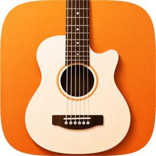<figcaption>吉他</figcaption></figure>
  <figure>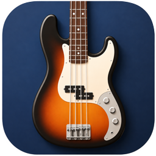<figcaption>贝斯</figcaption></figure>
  <figure>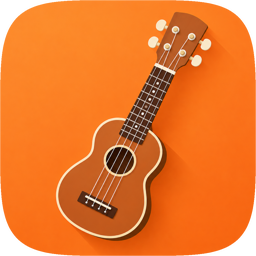<figcaption>尤克里里</figcaption></figure>
  <figure>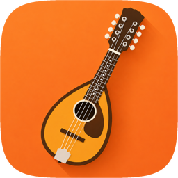<figcaption>曼陀林</figcaption></figure>
  <figure><figcaption>班卓</figcaption></figure>
  <figure>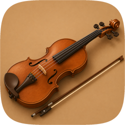<figcaption>小提琴</figcaption></figure>
  <figure>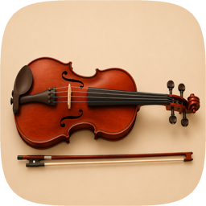<figcaption>中提琴</figcaption></figure>
  <figure>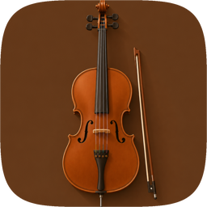<figcaption>大提琴</figcaption></figure>
  <figure>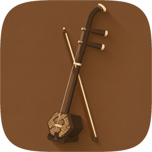<figcaption>二胡</figcaption></figure>
  <figure>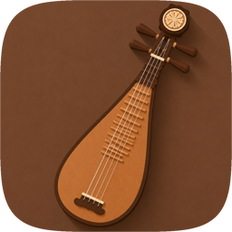<figcaption>琵琶</figcaption></figure>
  <figure>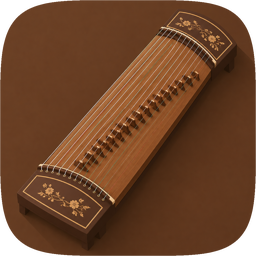<figcaption>古筝</figcaption></figure>
  <figure>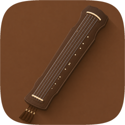<figcaption>古琴</figcaption></figure>

